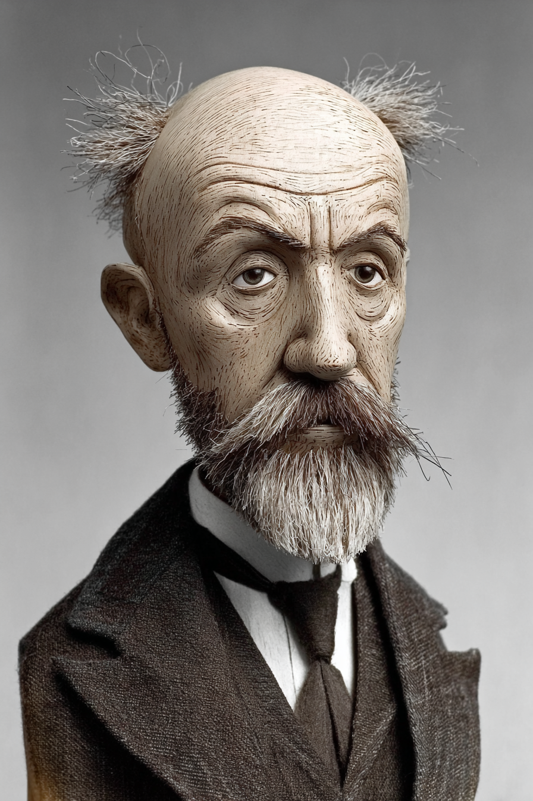
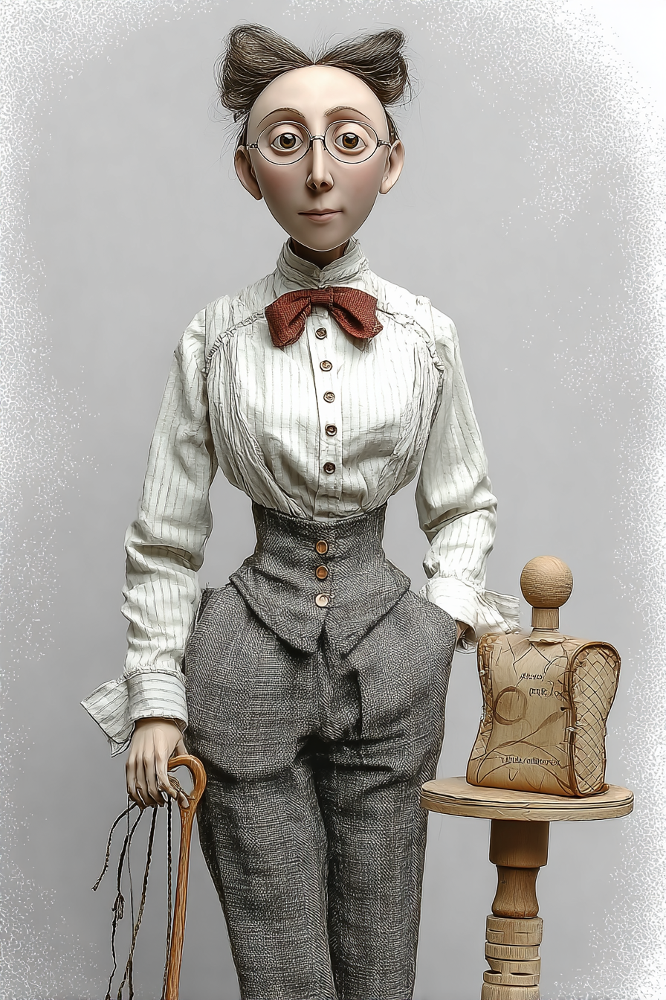
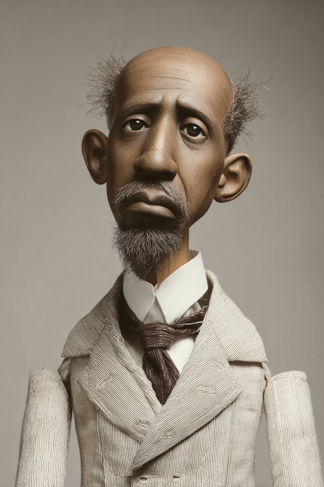

# Contemporary Mathematics — Wayback Sections

> Extracted from `chapters/`. Each entry corresponds to one chapter file.
> Sections are instructor-authored. Missing sections show a placeholder only.
> Do not edit this file directly — edit the source chapter file, then re-run extraction.

---

## Chapter 00: Contemporary Mathematics: with LLMs
*Source: `chapters/00-frontmatter.md`*

> **Section not yet authored.** No `## AI Wayback Machine` block found in this chapter file.
> To add this section, edit the source chapter file directly.

---

## Chapter 00: Introduction
*Source: `chapters/00-introduction.md`*

> **Section not yet authored.** No `## AI Wayback Machine` block found in this chapter file.
> To add this section, edit the source chapter file directly.

---

## Chapter 01: Chapter 1 — Sets
*Source: `chapters/01-sets.md`*

##  AI Wayback Machine



*Puppet Art by [Nik Bear Brown](https://www.nikbearbrown.com/).*

**Run this:**

```
Who is Georg Cantor, and how does their work connect to set theory we covered in this chapter? Keep it to three paragraphs. End with the single most surprising thing about their career or ideas.
```

→ Search **"Georg Cantor"** on Wikipedia.

**Now make the prompt better.** Try one of these:

- Ask it to apply Georg Cantor's ideas to a specific concrete problem in this chapter.
- Add a constraint: "Answer including criticisms or limits of Georg Cantor's framework."

What changes? What gets better? What gets worse?

---

## Chapter 02: Chapter 2 — Logic
*Source: `chapters/02-logic.md`*

##  AI Wayback Machine
**George Boole** was developed Boolean algebra in 1854 — turning logic into mathematics. Every modern computer reasons in Boole's framework.

**Run this:**

```
Who is George Boole, and how does their work connect to logic we covered in this chapter? Keep it to three paragraphs. End with the single most surprising thing about their career or ideas.
```

→ Search **"George Boole"** on Wikipedia.

**Now make the prompt better.** Try one of these:

- Ask it to apply George Boole's ideas to a specific concrete problem in this chapter.
- Add a constraint: "Answer including criticisms or limits of George Boole's framework."

What changes? What gets better? What gets worse?

---

## Chapter 03: Chapter 3 — Real Numbers and Number Theory
*Source: `chapters/03-real-number-systems-and-number-theory.md`*

##  AI Wayback Machine
**Srinivasa Ramanujan** was self-taught Indian mathematician who produced thousands of identities and theorems in number theory before dying at 32 — many still being unpacked a century later.

**Run this:**

```
Who is Srinivasa Ramanujan, and how does their work connect to number theory we covered in this chapter? Keep it to three paragraphs. End with the single most surprising thing about their career or ideas.
```

→ Search **"Srinivasa Ramanujan"** on Wikipedia.

**Now make the prompt better.** Try one of these:

- Ask it to apply Srinivasa Ramanujan's ideas to a specific concrete problem in this chapter.
- Add a constraint: "Answer including criticisms or limits of Srinivasa Ramanujan's framework."

What changes? What gets better? What gets worse?

---

## Chapter 04: Chapter 4 — Number Representation and Calculation
*Source: `chapters/04-number-representation-and-calculation.md`*

##  AI Wayback Machine
**Al-Kindi** was 9th-century Arab philosopher and mathematician who developed the place-value Hindu-Arabic numeral system into a form Europe would later adopt.

**Run this:**

```
Who is Al-Kindi, and how does their work connect to number representation we covered in this chapter? Keep it to three paragraphs. End with the single most surprising thing about their career or ideas.
```

→ Search **"Al-Kindi"** on Wikipedia.

**Now make the prompt better.** Try one of these:

- Ask it to apply Al-Kindi's ideas to a specific concrete problem in this chapter.
- Add a constraint: "Answer including criticisms or limits of Al-Kindi's framework."

What changes? What gets better? What gets worse?

---

## Chapter 05: Chapter 5 — Algebra
*Source: `chapters/05-algebra.md`*

##  AI Wayback Machine
**Emmy Noether** was founded modern abstract algebra in the 1920s — and proved the theorem connecting symmetries to conservation laws. She couldn't hold a salaried position in Germany because she was a woman.



*Puppet Art by [Nik Bear Brown](https://www.nikbearbrown.com/).*

**Run this:**

```
Who is Emmy Noether, and how does their work connect to algebra we covered in this chapter? Keep it to three paragraphs. End with the single most surprising thing about their career or ideas.
```

→ Search **"Emmy Noether"** on Wikipedia.

**Now make the prompt better.** Try one of these:

- Ask it to apply Emmy Noether's ideas to a specific concrete problem in this chapter.
- Add a constraint: "Answer including criticisms or limits of Emmy Noether's framework."

What changes? What gets better? What gets worse?

---

## Chapter 06: Chapter 6 — Money Management
*Source: `chapters/06-money-management.md`*

##  AI Wayback Machine
**Robert Shiller** was Nobel-winning economist whose work on behavioral finance reframed money management around the predictable irrationalities of human decision-making.

**Run this:**

```
Who is Robert Shiller, and how does their work connect to money management we covered in this chapter? Keep it to three paragraphs. End with the single most surprising thing about their career or ideas.
```

→ Search **"Robert Shiller"** on Wikipedia.

**Now make the prompt better.** Try one of these:

- Ask it to apply Robert Shiller's ideas to a specific concrete problem in this chapter.
- Add a constraint: "Answer including criticisms or limits of Robert Shiller's framework."

What changes? What gets better? What gets worse?

---

## Chapter 07: Chapter 7 — Probability
*Source: `chapters/07-probability.md`*

##  AI Wayback Machine
**Florence Nightingale David** was 20th-century British statistician — Karl Pearson's protégée — whose work on combinatorial probability remains in standard textbooks.


*Puppet Art by [Nik Bear Brown](https://www.nikbearbrown.com/).*

**Run this:**

```
Who is Florence Nightingale David, and how does their work connect to probability we covered in this chapter? Keep it to three paragraphs. End with the single most surprising thing about their career or ideas.
```

→ Search **"Florence Nightingale David"** on Wikipedia.

**Now make the prompt better.** Try one of these:

- Ask it to apply Florence Nightingale David's ideas to a specific concrete problem in this chapter.
- Add a constraint: "Answer including criticisms or limits of Florence Nightingale David's framework."

What changes? What gets better? What gets worse?

---

## Chapter 08: Chapter 8 — Statistics
*Source: `chapters/08-statistics.md`*

##  AI Wayback Machine
**W.E.B. Du Bois** was built foundational statistical sociology in 'The Philadelphia Negro' (1899) — applying rigorous quantitative methods to questions of race and inequality decades before the field was named.



*Puppet Art by [Nik Bear Brown](https://www.nikbearbrown.com/).*

**Run this:**

```
Who is W.E.B. Du Bois, and how does their work connect to statistics we covered in this chapter? Keep it to three paragraphs. End with the single most surprising thing about their career or ideas.
```

→ Search **"W.E.B. Du Bois"** on Wikipedia.

**Now make the prompt better.** Try one of these:

- Ask it to apply W.E.B. Du Bois's ideas to a specific concrete problem in this chapter.
- Add a constraint: "Answer including criticisms or limits of W.E.B. Du Bois's framework."

What changes? What gets better? What gets worse?

---

## Chapter 09: Chapter 9 — Metric Measurement
*Source: `chapters/09-metric-measurement.md`*

##  AI Wayback Machine
**Pierre Méchain** was French astronomer whose careful geodetic measurements between Dunkirk and Barcelona helped define the meter as one ten-millionth of the distance from pole to equator.


*Puppet Art by [Nik Bear Brown](https://www.nikbearbrown.com/).*

**Run this:**

```
Who is Pierre Méchain, and how does their work connect to metric measurement we covered in this chapter? Keep it to three paragraphs. End with the single most surprising thing about their career or ideas.
```

→ Search **"Pierre Méchain"** on Wikipedia.

**Now make the prompt better.** Try one of these:

- Ask it to apply Pierre Méchain's ideas to a specific concrete problem in this chapter.
- Add a constraint: "Answer including criticisms or limits of Pierre Méchain's framework."

What changes? What gets better? What gets worse?

---

## Chapter 10: Chapter 10 — Geometry
*Source: `chapters/10-geometry.md`*

##  AI Wayback Machine
**Bonaventura Cavalieri** was 17th-century Italian mathematician whose 'method of indivisibles' anticipated integral calculus — and whose principle for comparing areas and volumes still appears in every geometry textbook.

**Run this:**

```
Who is Bonaventura Cavalieri, and how does their work connect to geometry we covered in this chapter? Keep it to three paragraphs. End with the single most surprising thing about their career or ideas.
```

→ Search **"Bonaventura Cavalieri"** on Wikipedia.

**Now make the prompt better.** Try one of these:

- Ask it to apply Bonaventura Cavalieri's ideas to a specific concrete problem in this chapter.
- Add a constraint: "Answer including criticisms or limits of Bonaventura Cavalieri's framework."

What changes? What gets better? What gets worse?

---

## Chapter 11: Chapter 11 — Voting and Apportionment
*Source: `chapters/11-voting-and-apportionment.md`*

##  AI Wayback Machine
**Kenneth Arrow** was economist whose 1951 impossibility theorem proved that no voting rule can simultaneously satisfy a short list of seemingly obvious fairness conditions.


*Puppet Art by [Nik Bear Brown](https://www.nikbearbrown.com/).*

**Run this:**

```
Who is Kenneth Arrow, and how does their work connect to voting and apportionment we covered in this chapter? Keep it to three paragraphs. End with the single most surprising thing about their career or ideas.
```

→ Search **"Kenneth Arrow"** on Wikipedia.

**Now make the prompt better.** Try one of these:

- Ask it to apply Kenneth Arrow's ideas to a specific concrete problem in this chapter.
- Add a constraint: "Answer including criticisms or limits of Kenneth Arrow's framework."

What changes? What gets better? What gets worse?

---

## Chapter 12: Chapter 12 — Graph Theory
*Source: `chapters/12-graph-theory.md`*

##  AI Wayback Machine
**Paul Erdős** was prolific Hungarian mathematician who wrote over 1,500 papers and lived out of suitcases his entire adult life — and built a substantial portion of modern graph theory.

**Run this:**

```
Who is Paul Erdős, and how does their work connect to graph theory we covered in this chapter? Keep it to three paragraphs. End with the single most surprising thing about their career or ideas.
```

→ Search **"Paul Erdős"** on Wikipedia.

**Now make the prompt better.** Try one of these:

- Ask it to apply Paul Erdős's ideas to a specific concrete problem in this chapter.
- Add a constraint: "Answer including criticisms or limits of Paul Erdős's framework."

What changes? What gets better? What gets worse?

---

## Chapter 13: Chapter 13 — Math and...
*Source: `chapters/13-math-and.md`*

##  AI Wayback Machine
**Hannah Fry** was contemporary British mathematician whose work makes the connections between math and modern life — algorithms, romance, fairness, justice — visible to general audiences.


*Puppet Art by [Nik Bear Brown](https://www.nikbearbrown.com/).*

**Run this:**

```
Who is Hannah Fry, and how does their work connect to math and the modern world we covered in this chapter? Keep it to three paragraphs. End with the single most surprising thing about their career or ideas.
```

→ Search **"Hannah Fry"** on Wikipedia.

**Now make the prompt better.** Try one of these:

- Ask it to apply Hannah Fry's ideas to a specific concrete problem in this chapter.
- Add a constraint: "Answer including criticisms or limits of Hannah Fry's framework."

What changes? What gets better? What gets worse?

---

## Chapter 99: 99 Back Matter
*Source: `chapters/99-back-matter.md`*

> **Section not yet authored.** No `## AI Wayback Machine` block found in this chapter file.
> To add this section, edit the source chapter file directly.

---
